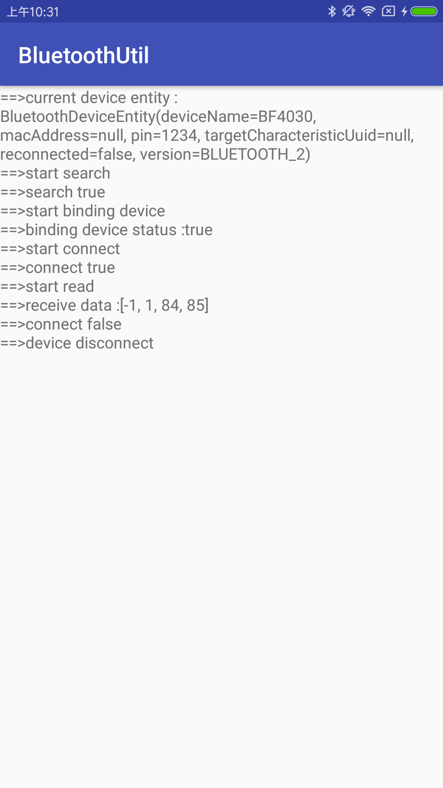

## 提供android下蓝牙2.0及4.0测量，蓝牙2.0实现自动绑定

### 蓝牙4.0演示截图

### 蓝牙2.0演示截图

## 基于本工程实现的蓝牙调试工具可查看模块[abluetoothtools](https://github.com/HelloHuDi/android-bluetooth-handler/tree/master/abluetoothtools)

## 资料：

### [google 4.0 demo](https://github.com/googlesamples/android-BluetoothLeGatt)
