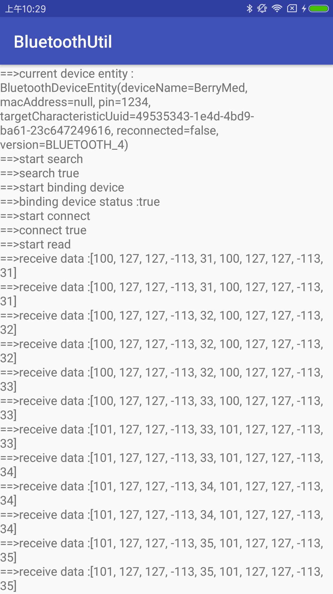

# android Bluetooth handler [](https://github.com/HelloHuDi/android-bluetooth-handler/blob/master/abluetoothtools/release/app-release.apk) [](https://github.com/HelloHuDi/android-bluetooth-handler/blob/master/abluetoothtools/release/app-release.apk) 

## Provided Bluetooth 2 and 4 working handler of under Android , and Bluetooth 2 achieves automatic binding

## [中文README](README_ch.md)

### screenshot

 

### use：
```
 compile 'com.hd:bluetoothutil:1.0'
```

### start scan device:
```
Scanner.scan(Context, BluetoothAdapter?, BluetoothDeviceEntity, ScannerCallback)
```

### stop scan device:
```
Scanner.stopScan()
```

### start measure
```
BluetoothController.init(Context,BluetoothDeviceEntity,BluetoothDevice?,MeasureProgressCallback).startMeasure()
```

### stop measure
```
BluetoothController.stopMeasure()
```

### open the print function
```
BL.allowLog=BuildConfig.DEBUG
```

### BluetoothDeviceEntity：

name                      | attribute   | function
-------------------------|-------|----
deviceName               | String  | The name of the device (if the parameter is empty in the scanning work, all devices are scanned by default)
macAddress               | String   | Device MAC address
pin                      | String   | Paired pin code (for bluetooth 2.0 device), default 1234
targetCharacteristicUuid | UUID   | Focus on reading and writing special effects for BluetoothGattCharacteristic
reconnected              | Boolean   | If there is a failure in the equipment work, if you need to reconnect, the default false
version                  | DeviceVersion   |Target Bluetooth device version (2.0 and 4.0) 

## Bluetooth debug tool [abluetoothtools](https://github.com/HelloHuDi/android-bluetooth-handler/tree/master/abluetoothtools)

## data ： [google 4.0 demo](https://github.com/googlesamples/android-BluetoothLeGatt)
