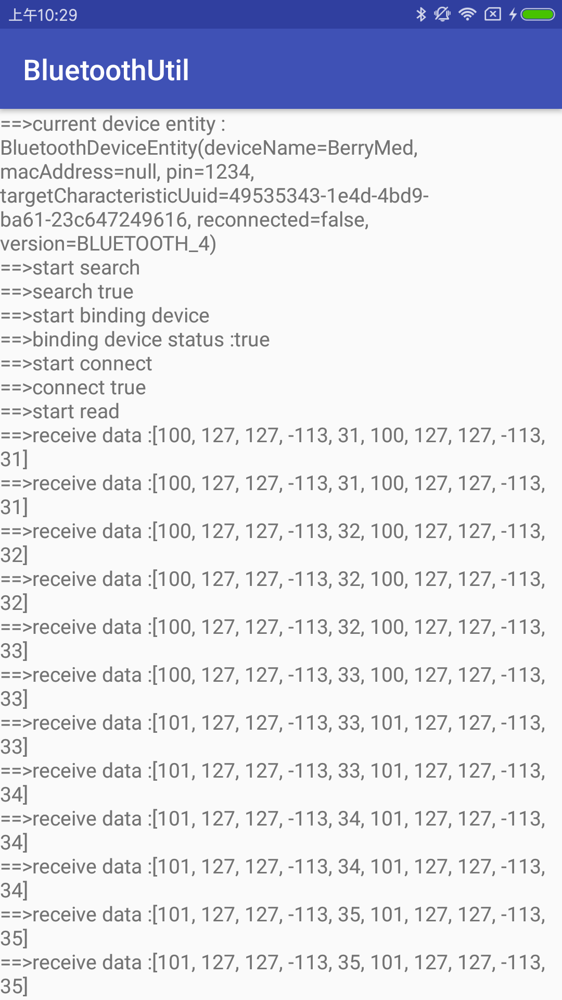
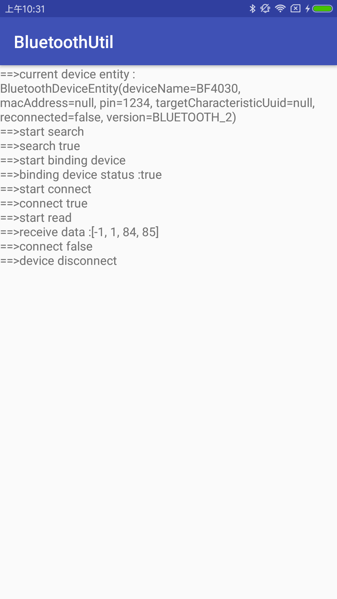

# android Bluetooth handler [](https://raw.githubusercontent.com/HelloHuDi/android-bluetooth-handler/master/abluetoothtools/release/app-release.apk) [](https://raw.githubusercontent.com/HelloHuDi/android-bluetooth-handler/master/abluetoothtools/release/app-release.apk) 

## 提供android下蓝牙2.0及4.0测量，蓝牙2.0实现自动绑定

### 蓝牙演示截图

 

### 使用：
```
 compile 'com.hd:bluetoothutil:1.0'
```

### 开始扫描设备:
```
Scanner.scan(Context, BluetoothAdapter?, BluetoothDeviceEntity, ScannerCallback)
```

### 停止扫描设备:
```
Scanner.stopScan()
```

### 开始测量
```
BluetoothController.init(Context,BluetoothDeviceEntity,BluetoothDevice?,MeasureProgressCallback).startMeasure()
```

### 停止测量
```
BluetoothController.stopMeasure()
```

### 打开测量过程中打印：
```
BL.allowLog=BuildConfig.DEBUG
```

### BluetoothDeviceEntity：

内容                      | 属性   | 解释
-------------------------|-------|----
deviceName               | String  | 设备名(扫描工作中若该参数为空，则默认扫描所有设备，不为空则扫描指定设备)
macAddress               | String   | 设备mac地址
pin                      | String   | 配对pin码(针对2.0设备),默认1234
targetCharacteristicUuid | UUID   | 针对具有读写特性的BluetoothGattCharacteristic
reconnected              | Boolean   | 如果设备工作失败，如果需要重新连接，则默认为false
version                  | DeviceVersion   | 设备版本号(2.0 and 4.0)

## 基于本工程实现的蓝牙调试工具可查看模块[abluetoothtools](https://github.com/HelloHuDi/android-bluetooth-handler/tree/master/abluetoothtools)

## 资料 ： [google 4.0 demo](https://github.com/googlesamples/android-BluetoothLeGatt)
